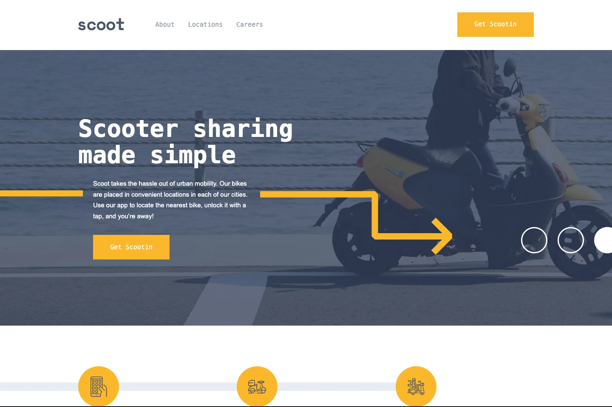

# Scoot Multi-Page Website

Scoot is a fictional scooter sharing service available in big cities.



[Live Demo](https://matt-miguel.github.io/scoot-website/) · [View Code](https://github.com/matt-miguel/scoot-website)

---

## Overview

A fully responsive 4-page marketing website built with vanilla HTML, CSS, and JavaScript. Demonstrates scalable CSS architecture and reusable layout patterns across multiple pages.

---

## Features

- Reusable decorative components with CSS classes
- Animated mobile menu that slides in and out
- Reusable layout classes to easily create multiple pages quickly

---

## Technical Highlights

**Reusable Decorative Patterns**

The site's decorative arrow elements repeat across multiple pages with varying positions. Rather than hardcoding styles per-page, I built a set of utility classes that handle placement and orientation — drop the class on any element and it works. This kept the CSS DRY and made adding new pages straightforward.

**Modern CSS**

The mobile menu and accordion use `interpolate-size: allow-keywords` and `transition-behavior: allow-discrete` to animate to and from `height: auto` and `display: none` — values that traditionally can't be transitioned. This avoids JavaScript height calculations and keeps the animation logic entirely in CSS.

---

## Tech Stack

- Semantic HTML
- CSS (Grid, custom properties, mobile-first)
- JavaScript

---

## Getting Started

```bash
git clone https://github.com/matt-miguel/scoot-website
cd fem-scoot-challenge
```

Open `index.html` in your browser or use a local dev server like Live Server.

---

## Challenges & What I Learned

**Implementing consistent styles and layouts**

The first challenge I tackled in this design was how to implement similar design patterns easily throughout the site. I created CSS classes that could be dropped on to any element or container that would immediately apply the styles and be responsive. This helped keep my code DRY.

**Animating mobile menu**

I wanted the menu to slide in and out on mobile. I ran into issues getting this animation to work properly so I researched CSS animation APIs. Using `interpolate-size: allow-keywords` in combination with `@starting-style` allowed me to achieve a smooth animation.

---

## What I'd Improve

**Map Decoration**

I would like to move the cities on the locations page to be on the map to show where it is located in the world. This would make the page more engaging.

**Component Architecture**

I would extract the header and the footer into components that can be dropped in site wide. The individual 2 and 3 column sections could also be its own component where content can be dropped into. This would overall make the site more maintainable. Astro would be my framework of choice for this.
